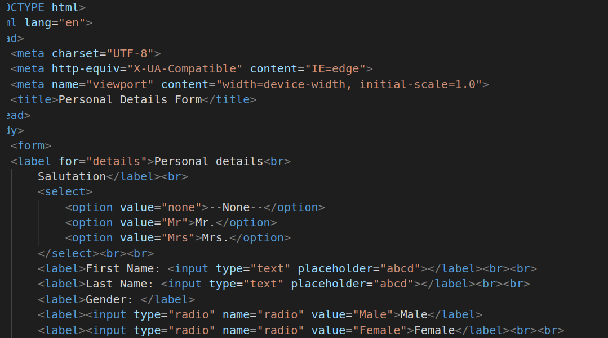
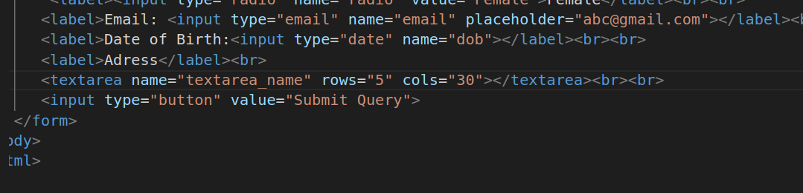

# Personal Detail Form
1.
##### Explanation
* form tag is used to create a form that contains input elements
* label it defines label for form elements.
* input it is used to get input data from the form in various types such as text, password, email, etc by changing its type.
* Radio buttons allow the user to select one option from a set.
* select it is used to create a drop-down list.
* option it is used to define options in a drop-down list

2.
* email tag is used for email address
* date is used for select date year and day
*  textarea it is used to get input long text content
* br is used to line break
* text is input type it provides text box to enter some content linke name email address.
* placeholder is text that appears in the form control when it has no value set 